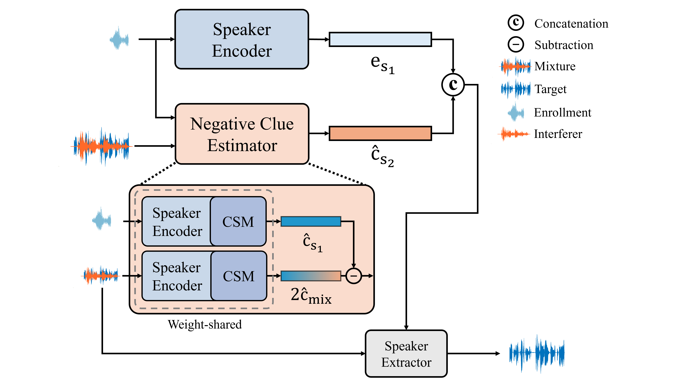
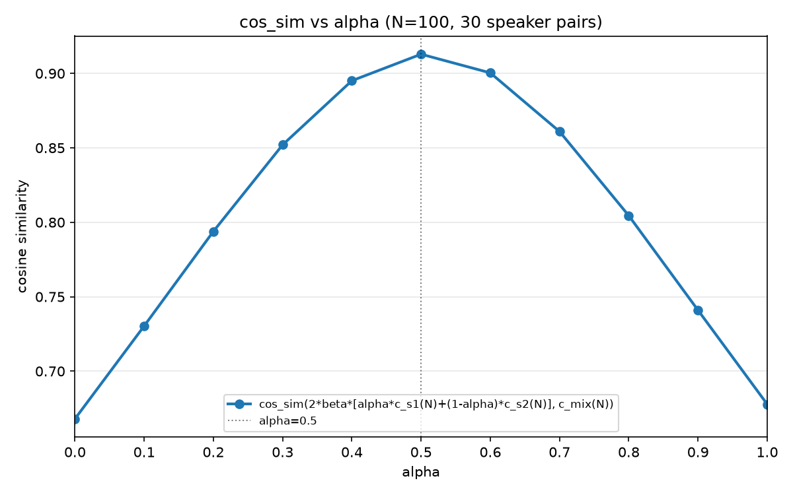
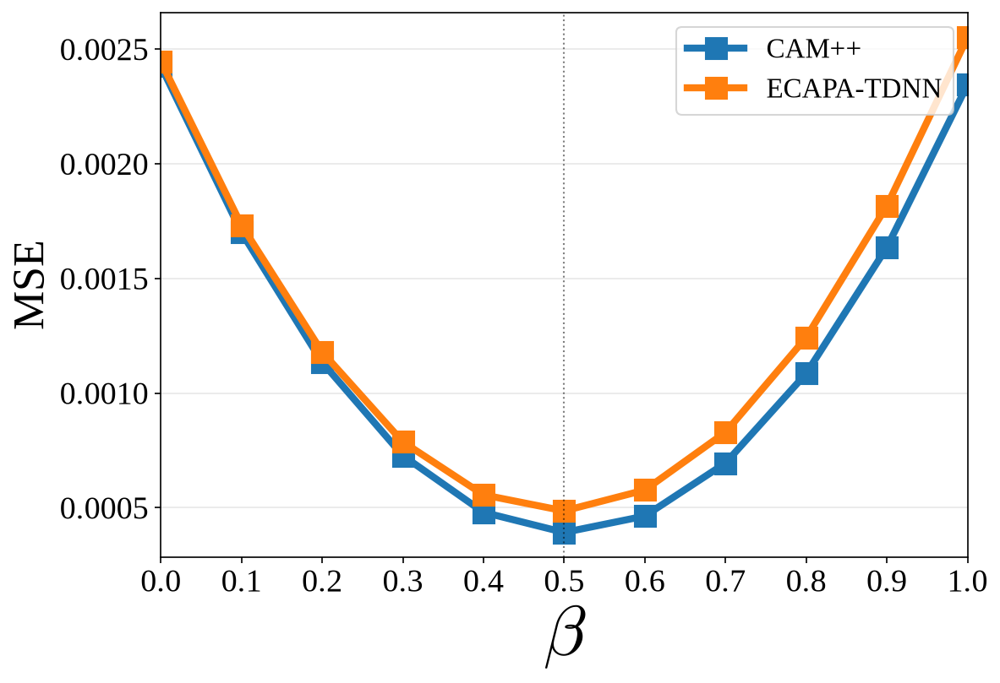
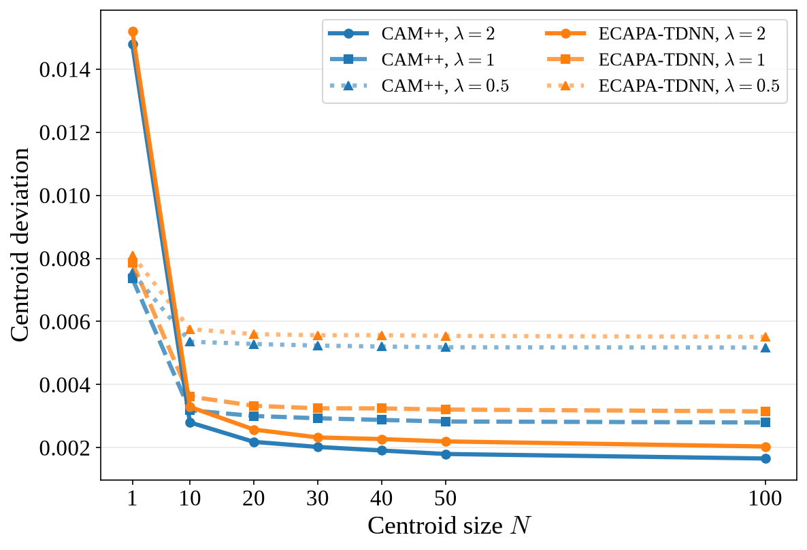
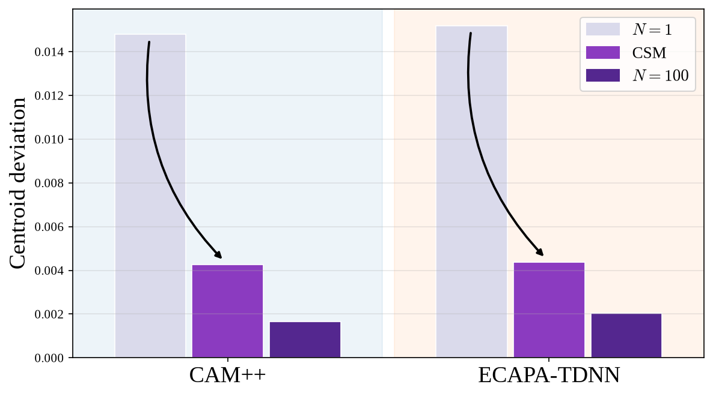
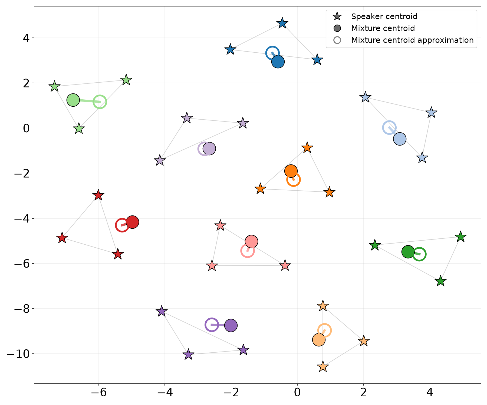

# NECTAR



**"NECTAR: Automatic Negative Clue Estimation via Centroid-Space
Mapping for Target Speaker Extraction"** 

(Submitted to ICASSP 2027).

Target speaker extraction (TSE) conditions on a target enrollment embedding
("positive clue"). NECTAR additionally derives a *negative clue* — an
estimate of the interfering speaker's embedding — directly from the mixture
and target enrollment, using an **centroid-space relationship**:
the mixture centroid lies near the midpoint of its constituent speakers'
centroids (`c_mix ≈ 0.5·(c_s1 + c_s2)`). The
**Centroid-Space Mapper (CSM)**, recovers this relationship from a single
utterance/mixture at inference time.

## Repository layout

```
BSRNN/    TSE backbone (BSRNN separator) + training/eval scripts (Table 1/3/4)
csm/      Centroid-Space Mapper: model, training, precompute, and figure scripts (Sec. 3, Fig. 1/2/5)
dataset/  Dataset download/generation scripts and (after setup) local data
```

The `csm/speakerlab` package is adapted from the open-source
[3D-Speaker](https://github.com/alibaba-damo-academy/3D-Speaker) toolkit.

## Setup

```bash
conda create -n nectar python=3.11 && conda activate nectar
pip install -r requirements.txt
```

Both BSRNN and CSM use a frozen, pretrained CAM++ speaker encoder (CSM's
encoder-comparison configs also use ECAPA-TDNN). Download both from
ModelScope — the code expects them under `~/.cache/modelscope/models/...`,
which is where `modelscope download` places them by default:

```bash
pip install modelscope
modelscope download --model iic/speech_campplus_sv_zh_en_16k-common_advanced
modelscope download --model iic/speech_ecapa-tdnn_sv_en_voxceleb_16k
```
## 1. Dataset

Data lands under `dataset/data/`.

- **LibriSpeech + WHAM! + Libri2Mix** (main training/eval data) — generated via
  [`dataset/scripts/librimix/generate/run_all.sh`](dataset/scripts/librimix/generate/run_all.sh),
  built on [LibriMix](https://github.com/JorisCos/LibriMix).
- **VCTK-2Mix** (out-of-domain eval, Table 3) — built from
  [VCTK 0.92](https://datashare.ed.ac.uk/handle/10283/3443) using
  [VCTK-2Mix](https://github.com/JorisCos/VCTK-2Mix).

## 2. Precompute centroid caches

Oracle speaker/mixture centroids (used as CSM training targets and as
oracle references in Table 1) are precomputed once:

```bash
cd csm
# Per-speaker centroids (CAM++): enroll-branch target + oracle eval reference
python speakerlab/bin/preprocessing/precompute_centroids.py --subsets train-100 \
    --output ../dataset/data/centroid_cache/without_norm/train_speaker_centroids_100.pt
python speakerlab/bin/preprocessing/precompute_centroids.py --subsets dev \
    --output ../dataset/data/centroid_cache/without_norm/dev_speaker_centroids.pt
python speakerlab/bin/preprocessing/precompute_centroids.py --subsets test \
    --output ../dataset/data/centroid_cache/without_norm/test_speaker_centroids.pt

# Mixture-pair centroids (CAM++): oracle "Centroid Approx." reference (Table 1)
python speakerlab/bin/preprocessing/precompute_mixture_centroids.py --subsets test \
    --output ../dataset/data/centroid_cache/without_norm/mixture_pair_centroids_test.pt

# ECAPA-TDNN analogs, for the encoder comparison (Fig. 1/2)
python speakerlab/bin/preprocessing/precompute_centroids.py --subsets train-100 --backbone ecapa \
    --output ../dataset/data/centroid_cache/without_norm/train_speaker_centroids_100_ecapa.pt
python speakerlab/bin/preprocessing/precompute_centroids.py --subsets dev --backbone ecapa \
    --output ../dataset/data/centroid_cache/without_norm/dev_speaker_centroids_ecapa.pt
```


## 3. Train the Centroid-Space Mapper (CSM)

```bash
cd csm
python speakerlab/bin/train.py --config conf/csm.yaml         # CAM++ backbone

python speakerlab/bin/train.py --config conf/csm_ecapa.yaml   # ECAPA-TDNN backbone
python speakerlab/bin/train.py --config conf/csm_noisy.yaml   # noisy condition (Table 4)
```

Each run writes to `exp/csm/<name>/`.

## 4. Train the BSRNN backbones

```bash
cd BSRNN
python train.py --cfg configs/baseline.yml        # Table 1/4 "Baseline": positive clue only
python train.py --cfg configs/mixture_clue.yml     # Table 1 "Mixture Clue"
python train.py --cfg configs/nectar.yml           # Table 1/4 "NECTAR"
python train.py --cfg configs/baseline_noisy.yml    # Table 4, noisy condition
python train.py --cfg configs/nectar_noisy.yml      # Table 4, noisy condition
```

Each run writes to `exp/<name>/`.

## 5. Evaluate

```bash
cd BSRNN
python eval_baseline.py --cfg configs/baseline.yml   # Table 1 "Baseline"
python eval_mixture_clue.py                          # Table 1 "Mixture Clue"
python eval_nectar.py --cfg configs/nectar.yml        # Table 1's other rows, see below
python eval_baseline_vctk.py                          # Table 3, out-of-domain
python eval_nectar_vctk.py                            # Table 3, out-of-domain
```

`eval_baseline.py`/`eval_nectar.py` default to the noisy-condition configs
(Table 4) — pass `--cfg configs/baseline.yml` / `--cfg configs/nectar.yml`
explicitly for the clean-condition Table 1 numbers, as above.

`eval_nectar.py` scores several negative-clue constructions against the
NECTAR checkpoint in one pass: Oracle Utterance, Oracle Centroid, Centroid
Approx., NECTAR itself (the CSM-estimated clue, its `"estimator"` case), and
Embedding Approx. Use `--cases` to pick a subset (see `--help`).


<p align="center">
  
  
</p>


<p align="center">
  
</p>


<p align="center">
  
</p>


<p align="center">
  
</p>
<!-- 
To reproduce the "negligible computational overhead" params/FLOPs numbers:

```bash
python pipeline_cost.py
``` -->
<!-- 
## 6. Reproduce the paper's figures

```bash
cd csm
python speakerlab/bin/analysis/param_sweep.py            # Fig. 1: centroid-space relationship
python speakerlab/bin/analysis/beta_convergence.py --backbone campplus   # Fig. 2: centroid deviation vs. N
python speakerlab/bin/analysis/beta_convergence.py --backbone ecapa
python speakerlab/bin/analysis/embedding_analysis_3mix.py                # Fig. 5: 3-speaker extension (Sec. 5.2)
```

Each writes to `figures/<script_name>/`. The `csm/speakerlab/bin/plotting/`
scripts re-render these from the saved CSVs/caches without re-running any
model. -->

<!-- ## Citation

```bibtex
@inproceedings{yoo2027nectar,
  title     = {{NECTAR}: Automatic Negative Clue Estimation via Centroid-Space Mapping for Target Speaker Extraction},
  author    = {Yoo, Hyungjun and Lee, Yongjoon and Choi, Jung-Woo},
  booktitle = {ICASSP},
  year      = {2027}
}
``` -->
